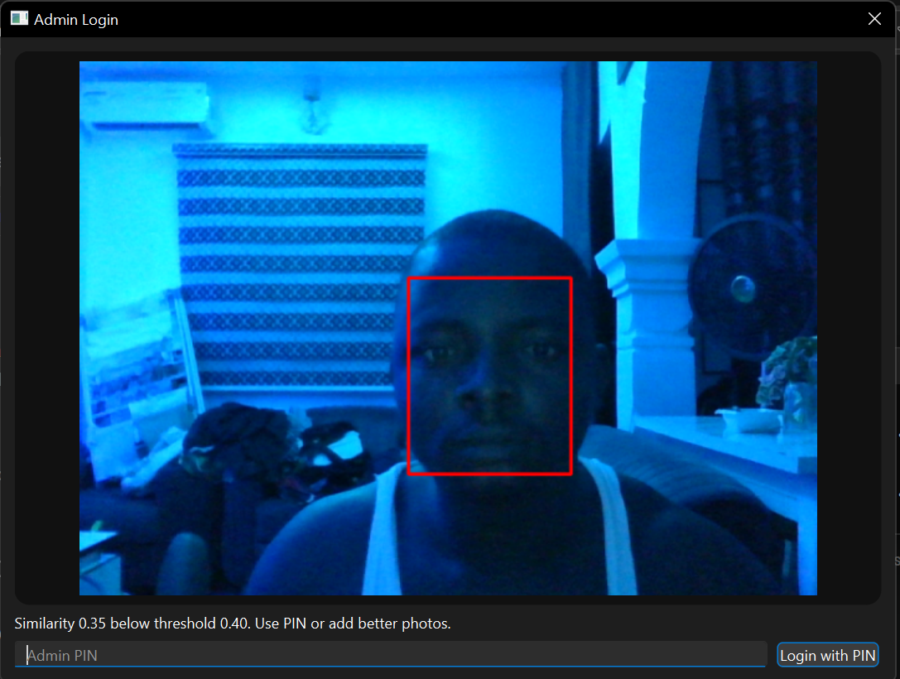
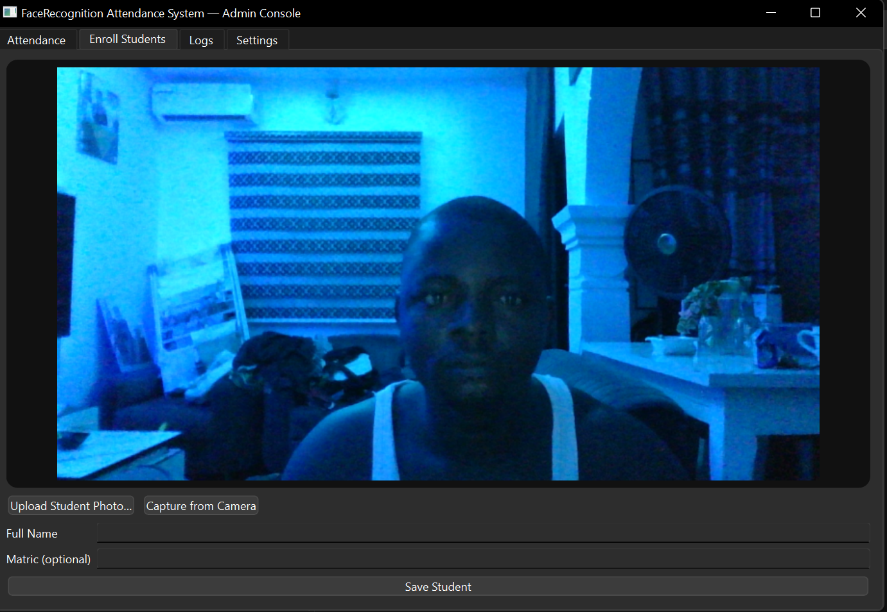
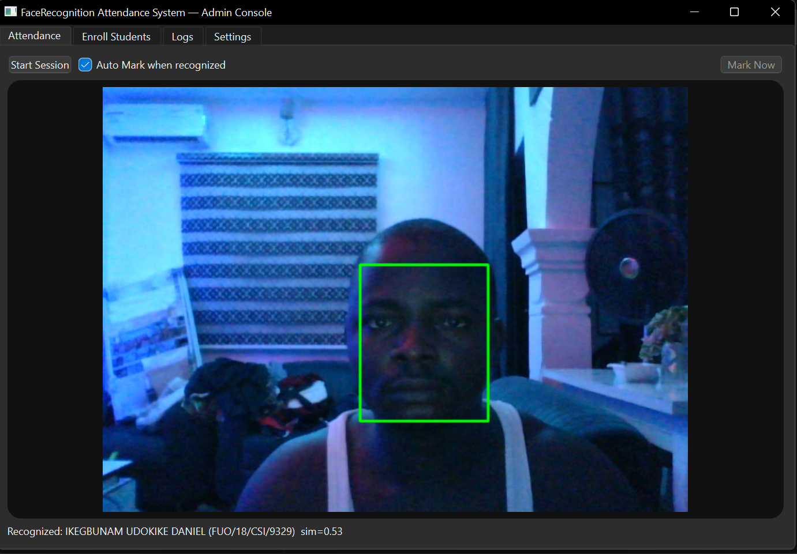
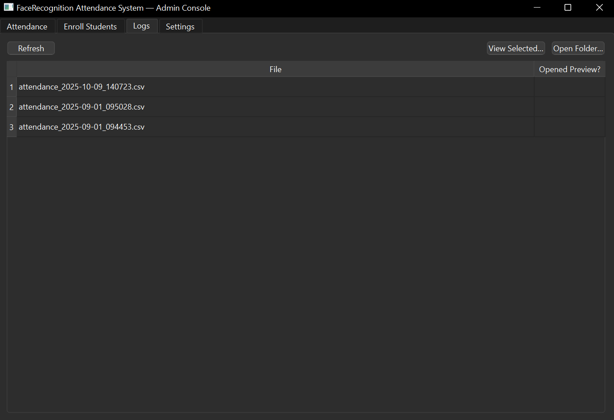

# 🎓 FaceRecognition Attendance System

<div align="center">

# AI-Powered Attendance Monitoring using Face Recognition

A desktop attendance management system that leverages **Artificial Intelligence and Computer Vision** to automate attendance recording using facial recognition.

Built with **Python, PySide6, OpenCV, ArcFace (ONNX), SQLite, and real-time inference.**


</div>

---

# 📌 Overview

Attendance tracking remains an important challenge across educational and organizational environments. Traditional methods are often time-consuming, error-prone, and vulnerable to impersonation.

This project introduces an **AI-powered attendance system** that automatically identifies registered individuals through **face recognition technology** and records attendance in real time.

The system combines **computer vision**, **deep learning embeddings**, and **desktop application engineering** into one practical solution.

---

# ✨ Features

## 🔐 Admin Authentication
Secure administrator access before attendance operations.

## 👤 Student Enrollment
Register users and generate facial embeddings for identification.

## 🎥 Real-Time Face Recognition
Identify students using live camera input.

## 📊 Attendance Logging
Automatically record attendance with timestamps.

## 📁 CSV Export
Export attendance records for reporting and analysis.

## 💾 Local Database Storage
Store attendance history and face data using SQLite.

## ⚡ Fast ONNX Inference
Optimized recognition pipeline for efficient execution.

---

# 🖼️ Application Screenshots

> Place your images inside the `screenshots/` folder.

---

## Login Interface



Secure access for administrators.

---

## Student Enrollment



Capture and register facial identities.

---

## Attendance Recognition



Live attendance marking through facial recognition.

---

## Attendance History



Review and export recorded attendance.

---

# 🧠 AI Architecture

```text
Camera Input
      │
      ▼
Face Detection
(OpenCV)

      │
      ▼

Face Alignment

      │
      ▼

Feature Extraction
(ArcFace ONNX)

      │
      ▼

Embedding Comparison

      │
      ▼

Identity Recognition

      │
      ▼

Attendance Logging
(SQLite + CSV)
```

---

# 🔬 Recognition Workflow

The attendance system follows these stages:

### Step 1 — Capture Image
Acquire live frames from the camera.

### Step 2 — Detect Face
Locate faces using OpenCV detection.

### Step 3 — Generate Embeddings
Convert detected faces into feature vectors.

### Step 4 — Similarity Matching
Compare vectors against enrolled students.

### Step 5 — Record Attendance
Store attendance data automatically.

---

# 🏗️ Project Structure

```text
FaceRecognitionAttendance/
│
├── app/
│   ├── services/
│   ├── ui/
│   ├── models/
│   ├── data/
│   └── main.py
│
├── screenshots/
│
├── requirements.txt
│
└── README.md
```

---

# ⚙️ Installation

## Clone Repository

```bash
git clone <repository-url>
```

Move into directory:

```bash
cd FaceRecognitionAttendance
```

Create virtual environment:

```bash
python -m venv .venv
```

Activate:

### Windows

```bash
.venv\Scripts\activate
```

### Linux / Mac

```bash
source .venv/bin/activate
```

Install dependencies:

```bash
pip install -r requirements.txt
```

Run:

```bash
python -m app.main
```

---

# 🗄️ Database

The project stores information locally.

Tables include:

| Table | Description |
|---|---|
| students | Registered identities |
| embeddings | Face vectors |
| attendance | Attendance records |

---

# 📈 Performance Goals

- Real-time attendance processing
- Efficient local inference
- Lightweight storage
- Minimal administrative workload

---

# 🎯 Research Relevance

This project demonstrates concepts in:

- Artificial Intelligence
- Machine Learning
- Computer Vision
- Pattern Recognition
- Deep Learning Applications
- Human Identification Systems
- Edge AI

This makes it suitable for:

✅ AI Portfolio Projects  
✅ Graduate Applications  
✅ Computer Vision Research  
✅ Scholarship Applications  

---

# 🚀 Future Improvements

- Face anti-spoofing
- Multi-camera deployment
- Cloud synchronization
- Mobile companion application
- Dashboard analytics
- Transformer-based recognition
- Docker deployment
- Web dashboard

---

# 🤝 Contributing

Contributions are welcome.

1. Fork repository
2. Create feature branch
3. Commit changes
4. Push branch
5. Open Pull Request

---

# 👨‍💻 Author

Developed as part of continuous learning in:

- Artificial Intelligence
- Computer Vision
- Software Engineering

If this project helped you, consider giving it a ⭐

---

> Building intelligent systems one project at a time.